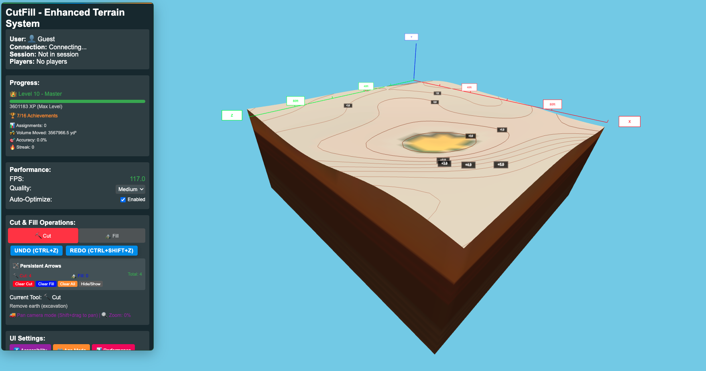

# CutFill: 3D Cut-and-Fill Earthworks Educational Game



**A sophisticated 3D interactive educational game teaching cut-and-fill earthworks principles through realistic terrain manipulation and collaborative gameplay.**

## 🎯 Project Overview

CutFill is a browser-based 3D game designed to teach cut-and-fill earthworks principles through hands-on terrain manipulation. Built during a 7-day AI-accelerated development challenge and enhanced with ongoing refinements, this project demonstrates rapid prototyping and production-quality software development using modern web technologies.

### 🎮 Core Concept

- **Realistic 3D Terrain**: Manipulate 100ft × 100ft terrain plots with volume-accurate operations
- **Net-Zero Mechanics**: Balance cut and fill operations to maintain volume equilibrium
- **Planning Workflow**: Plan operations with visual overlays, then execute with confirmation
- **Educational Focus**: Learn real-world engineering principles through hands-on simulation
- **Multiplayer Collaboration**: Work together in real-time on shared earthworks projects
- **Clean Visual Design**: Professional flat-shaded grayscale terrain with minimal visual clutter

## ✨ Key Features

### 🏗️ Advanced Terrain Manipulation System
- **2 Core Tools**: Cut (⛏️) and Fill (🏔️) tools with realistic earthmoving mechanics
- **5-Foot Depth Limits**: Realistic cut and fill constraints (5 feet maximum depth/height)
- **Volume-Accurate Physics**: Real-time cut-and-fill calculations with cubic yard precision
- **Planning Mode**: Plan operations with red/blue overlays, then execute with Save/Enter
- **Visual Feedback**: Grayscale terrain with selective cut/fill overlays and positioning arrows
- **Precision Controls**: Adjustable brush size, strength, shape (circle/square), and falloff patterns

### 🎓 Educational Components
- **Assignment System**: 15+ structured learning objectives
- **Progress Tracking**: XP system with 10 skill levels (Apprentice → Master)
- **16 Achievements**: Volume-based, tool mastery, accuracy, and speed challenges
- **Interactive Tutorials**: Contextual learning with "why" explanations

### 🌐 Multiplayer Features
- **Real-time Collaboration**: Up to 4 players working simultaneously
- **Player Roles**: Host, Participant, and Spectator with granular permissions
- **Session Management**: Create, join, and manage multiplayer sessions
- **Communication**: Built-in text chat and player activity tracking
- **Shared Objectives**: Collaborative and competitive assignment types

### 🎨 Polished User Experience
- **Clean Visual Design**: Flat-shaded grayscale terrain with minimal visual clutter
- **Smart Visual Feedback**: Cut/fill overlays appear only where operations have occurred
- **Intuitive Controls**: Keyboard shortcuts (Q/E for tools, G for terrain, Enter to execute)
- **Real-time Volume Display**: Live tracking of cut/fill volumes in cubic yards
- **Accessibility Features**: Screen reader support, keyboard navigation, high contrast
- **Responsive Design**: Optimized for desktop, tablet, and mobile devices
- **Professional UI**: Clean, technical interface with contextual tooltips and notifications

### ⚡ Performance Optimization
- **60 FPS Target**: Consistent performance across devices (achieving 121 FPS in testing)
- **Adaptive Quality**: Automatic optimization based on hardware capabilities
- **Memory Management**: Object pooling and intelligent resource cleanup
- **Performance Monitoring**: Real-time metrics and optimization suggestions

### 🔄 Recent Enhancements
- **Volume Calculation Fix**: Fixed terrain generation to properly reset volume calculations
- **Realistic Terrain Generation**: 5 mathematical terrain patterns (flat, gentle slopes, valleys, hills, rolling)
- **Clean Scale Reference**: Coordinate markers without visual clutter (removed grid lines)
- **Improved User Feedback**: Immediate volume display updates and generation notifications
- **Enhanced Planning Mode**: Better visual overlays and execution workflow

## 🚀 Technical Architecture

### Frontend Stack
- **Framework**: Vite + TypeScript
- **3D Graphics**: Three.js with WebGL rendering
- **Real-time**: Socket.io-client for multiplayer
- **Authentication**: Supabase Auth
- **Styling**: Modern CSS with responsive design

### Backend Stack
- **Runtime**: Node.js with Express
- **Real-time**: Socket.io for multiplayer sessions
- **Database**: PostgreSQL via Supabase
- **Authentication**: Row Level Security (RLS)

### Database Schema
- **Users**: Authentication and profile management
- **User Progress**: XP, levels, and achievement tracking
- **Sessions**: Multiplayer game session management
- **Assignments**: Educational content and objectives

## 🛠️ Quick Start

### Prerequisites
- Node.js 18+ and npm
- Git
- Modern web browser with WebGL 2.0 support

### Installation

1. **Clone the repository**
   ```bash
   git clone <repository-url>
   cd CutFill
   ```

2. **Install dependencies**
   ```bash
   # Install frontend dependencies
   cd src
   npm install
   
   # Install backend dependencies
   cd ../server
   npm install
   ```

3. **Environment setup**
   ```bash
   # Copy environment template
   cp src/env.example src/.env
   
   # Edit .env with your Supabase credentials
   # VITE_SUPABASE_URL=your-supabase-url
   # VITE_SUPABASE_ANON_KEY=your-supabase-anon-key
   ```

4. **Start development servers**
   ```bash
   # Terminal 1: Start backend server
   cd server
   npm run dev
   
   # Terminal 2: Start frontend development server
   cd src
   npm run dev
   ```

5. **Open in browser**
   - Frontend: http://localhost:5173
   - Backend: http://localhost:3001

## ⌨️ Key Controls

### Essential Shortcuts
- **Q**: Select Cut tool (⛏️) - Remove earth
- **E**: Select Fill tool (🏔️) - Add earth
- **G**: Generate new terrain with realistic patterns
- **Enter**: Execute planned cut/fill operations
- **R**: Reset terrain to original state
- **Ctrl + Drag**: Apply current tool (cut or fill)
- **N**: Toggle contour lines
- **1-4**: Quick brush size selection

### Camera Controls
- **Mouse Drag**: Rotate camera around terrain
- **Scroll Wheel**: Zoom in/out
- **Shift + Drag**: Pan camera (trackpad: two-finger scroll)

### Planning Mode
- **Plan Operations**: Select areas for cut/fill with visual red/blue overlays
- **Save Button**: Execute planned operations
- **Cancel Button**: Discard planned operations
- **Enter Key**: Quick execution of planned operations

## 🎯 Usage Guide

### Single Player Mode
1. **Authentication**: Create account or play as guest
2. **Terrain Generation**: Press 'G' to generate new realistic terrain patterns
3. **Tool Selection**: Press 'Q' for Cut tool, 'E' for Fill tool
4. **Planning Operations**: Plan cuts/fills with visual overlays, then press Enter to execute
5. **Volume Management**: Maintain volume balance - cut material must equal fill material
6. **Achievements**: Unlock 16 different achievement categories

### Multiplayer Mode
1. **Session Creation**: Host creates session with specific settings
2. **Player Joining**: Share session code with other players
3. **Collaborative Work**: Work together on shared terrain modifications
4. **Communication**: Use built-in chat and player tracking
5. **Volume Coordination**: Team must balance cut and fill operations together

### Age-Appropriate Modes
- **Kids Mode**: Simplified UI, colorful visuals, basic objectives
- **Teen Mode**: Moderate complexity, competitive elements
- **Adult Mode**: Full features, realistic mechanics
- **Professional Mode**: Advanced tools, precise measurements
- **Senior Mode**: Larger UI elements, simplified controls

## 🎮 Gameplay Mechanics

### Core Loop
1. **Terrain Generation**: Generate realistic terrain patterns (flat, slopes, valleys, hills, rolling)
2. **Tool Selection**: Choose Cut (⛏️) or Fill (🏔️) tools for earthmoving operations
3. **Planning Phase**: Plan operations with visual red/blue overlays showing planned modifications
4. **Execution**: Execute planned operations with Save button or Enter key
5. **Volume Balance**: Maintain net-zero earthworks - cut material should equal fill material
6. **Scale Reference**: Use coordinate markers to understand the 100ft × 100ft work area (10,000 sq ft)

### Scoring System
- **Primary**: Assignment completion (required)
- **Secondary**: Net-zero achievement (required)
- **Tertiary**: Speed and efficiency bonuses
- **Achievements**: Long-term progression rewards

## 🏆 Development Achievements

This project was completed in 7 days with the following milestones:

### Phase 1: Foundation (Days 1-2)
- ✅ Vite + TypeScript project setup
- ✅ Three.js 3D scene and terrain system
- ✅ Socket.io multiplayer infrastructure
- ✅ Supabase authentication and database

### Phase 2: Core Features (Days 3-4)
- ✅ Advanced terrain manipulation tools
- ✅ Visual feedback and terrain rendering
- ✅ Multi-tool system with realistic behaviors
- ✅ Educational assignment system

### Phase 3: User Experience (Days 5-6)
- ✅ Progress tracking and achievement system
- ✅ Enhanced multiplayer collaboration
- ✅ UI/UX polish with accessibility features
- ✅ Age-appropriate mode system

### Phase 4: Optimization (Day 7)
- ✅ Performance optimization (60 FPS target)
- ✅ Memory management and resource cleanup
- ✅ Cross-platform compatibility
- ✅ Production-ready deployment

## 🔧 Performance Specifications

### Performance Targets
- **Target FPS**: 60 FPS consistent
- **Memory Usage**: <512 MB maximum
- **Load Time**: <3 seconds initial load
- **Latency**: <100ms multiplayer response

### Optimization Features
- **Adaptive Quality**: Automatic performance scaling
- **LOD System**: Level-of-detail rendering
- **Object Pooling**: Efficient memory management
- **Frustum Culling**: Optimized rendering pipeline

## 🌐 Browser Support

### Minimum Requirements
- Chrome 80+, Firefox 75+, Safari 13+, Edge 80+
- WebGL 2.0 support
- 2GB RAM minimum
- Hardware acceleration enabled

### Recommended
- Modern desktop or laptop
- Dedicated graphics card
- 8GB+ RAM for optimal performance
- High-resolution display

## 📚 Educational Content

### Learning Objectives
- **Cut-and-Fill Principles**: Understanding volume balance
- **Tool Operation**: Realistic earthmoving equipment usage
- **Site Preparation**: Construction project planning
- **Water Management**: Drainage and erosion control
- **Environmental Impact**: Sustainable earthworks practices

### Age-Appropriate Curriculum
- **Elementary**: Basic concepts through play
- **Middle School**: STEM integration
- **High School**: Advanced engineering principles
- **Adult/Professional**: Industry-standard practices

## 🤝 Contributing

This project was developed as part of a 7-day AI-accelerated development challenge. While not actively maintained, the codebase serves as a reference for:

- Rapid prototyping with AI assistance
- Modern web game development patterns
- Educational game design principles
- Real-time multiplayer implementation

## 📄 License

This project is licensed under the MIT License - see the LICENSE file for details.

## 🙏 Acknowledgments

- **Development Challenge**: 7-day AI-accelerated development
- **Technologies**: Three.js, Socket.io, Supabase, Vite
- **Educational Focus**: Cut-and-fill earthworks principles
- **Community**: Civil engineering and permaculture professionals

---

**Built with ❤️ during a 7-day AI-accelerated development challenge**  
**Enhanced with ongoing refinements for optimal user experience**

*Demonstrating that AI-augmented developers can create production-quality software in record time, with continuous improvements based on user feedback and real-world testing.*

### Current Status
- ✅ **Core Features**: Complete cut/fill terrain manipulation system
- ✅ **Volume Accuracy**: Precise cubic yard calculations with proper reset functionality  
- ✅ **Clean UI**: Professional interface with minimal visual clutter
- ✅ **Realistic Terrain**: 5 mathematical terrain generation patterns
- ✅ **Planning Workflow**: Visual overlay system with execution confirmation
- ✅ **Performance**: 121 FPS achieved (exceeding 60 FPS target)
- 🔄 **Continuous Enhancement**: Ongoing improvements based on usage and feedback
