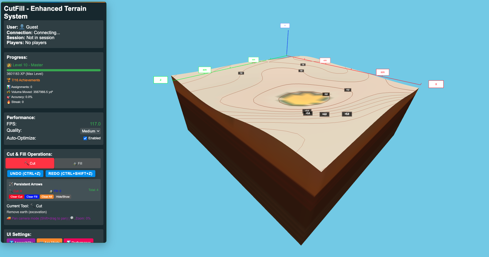

# CutFill: 3D Cut-and-Fill Earthworks Educational Game



**A 3D interactive educational game teaching cut-and-fill earthworks principles through engaging gameplay and real-time multiplayer collaboration.**

## 🎯 Project Overview

CutFill is a browser-based 3D game designed to teach cut-and-fill earthworks principles to a diverse audience ranging from children (8+) to professionals. Built during a 7-day AI-accelerated development challenge, this project demonstrates rapid prototyping and production-quality software development using modern web technologies.

### 🎮 Core Concept

- **Interactive 3D Terrain**: Manipulate realistic terrain using professional earthmoving tools
- **Net-Zero Mechanics**: Maintain volume balance while completing construction objectives
- **Educational Focus**: Learn real-world engineering principles through hands-on gameplay
- **Multiplayer Collaboration**: Work together in real-time on shared earthworks projects
- **Progressive Difficulty**: Scalable complexity for all age groups and skill levels

## ✨ Key Features

### 🏗️ Terrain Manipulation System
- **4 Professional Tools**: Excavator, Bulldozer, Grader, and Compactor
- **Realistic Physics**: Volume-accurate cut-and-fill operations
- **Visual Feedback**: Real-time terrain deformation with smooth animations
- **Precision Controls**: Adjustable brush size, strength, and tool-specific behaviors

### 🎓 Educational Components
- **Assignment System**: 15+ structured learning objectives
- **Progress Tracking**: XP system with 10 skill levels (Apprentice → Master)
- **16 Achievements**: Volume-based, tool mastery, accuracy, and speed challenges
- **Interactive Tutorials**: Contextual learning with "why" explanations

### 🌐 Multiplayer Features
- **Real-time Collaboration**: Up to 4 players working simultaneously
- **Player Roles**: Host, Participant, and Spectator with granular permissions
- **Session Management**: Create, join, and manage multiplayer sessions
- **Communication**: Built-in text chat and player activity tracking
- **Shared Objectives**: Collaborative and competitive assignment types

### 🎨 Adaptive User Experience
- **5 Age-Appropriate Modes**: Kids (8-12), Teen (13-17), Adult (18-35), Professional (25-60+), Senior (55+)
- **Accessibility Features**: Screen reader support, keyboard navigation, high contrast
- **Responsive Design**: Optimized for desktop, tablet, and mobile devices
- **Visual Enhancements**: Particle effects, smooth animations, and professional UI

### ⚡ Performance Optimization
- **60 FPS Target**: Consistent performance across devices
- **Adaptive Quality**: Automatic optimization based on hardware capabilities
- **Memory Management**: Object pooling and intelligent resource cleanup
- **Performance Monitoring**: Real-time metrics and optimization suggestions

## 🚀 Technical Architecture

### Frontend Stack
- **Framework**: Vite + TypeScript
- **3D Graphics**: Three.js with WebGL rendering
- **Real-time**: Socket.io-client for multiplayer
- **Authentication**: Supabase Auth
- **Styling**: Modern CSS with responsive design

### Backend Stack
- **Runtime**: Node.js with Express
- **Real-time**: Socket.io for multiplayer sessions
- **Database**: PostgreSQL via Supabase
- **Authentication**: Row Level Security (RLS)

### Database Schema
- **Users**: Authentication and profile management
- **User Progress**: XP, levels, and achievement tracking
- **Sessions**: Multiplayer game session management
- **Assignments**: Educational content and objectives

## 🛠️ Quick Start

### Prerequisites
- Node.js 18+ and npm
- Git
- Modern web browser with WebGL 2.0 support

### Installation

1. **Clone the repository**
   ```bash
   git clone <repository-url>
   cd CutFill
   ```

2. **Install dependencies**
   ```bash
   # Install frontend dependencies
   cd src
   npm install
   
   # Install backend dependencies
   cd ../server
   npm install
   ```

3. **Environment setup**
   ```bash
   # Copy environment template
   cp src/env.example src/.env
   
   # Edit .env with your Supabase credentials
   # VITE_SUPABASE_URL=your-supabase-url
   # VITE_SUPABASE_ANON_KEY=your-supabase-anon-key
   ```

4. **Start development servers**
   ```bash
   # Terminal 1: Start backend server
   cd server
   npm run dev
   
   # Terminal 2: Start frontend development server
   cd src
   npm run dev
   ```

5. **Open in browser**
   - Frontend: http://localhost:5173
   - Backend: http://localhost:3001

## 🎯 Usage Guide

### Single Player Mode
1. **Authentication**: Create account or play as guest
2. **Tutorial**: Complete the dirt-box micro-tutorial
3. **Assignments**: Progress through structured learning objectives
4. **Tools**: Master excavator, bulldozer, grader, and compactor operations
5. **Achievements**: Unlock 16 different achievement categories

### Multiplayer Mode
1. **Session Creation**: Host creates session with specific settings
2. **Player Joining**: Share session code with other players
3. **Collaborative Work**: Work together on shared terrain
4. **Communication**: Use built-in chat and player tracking
5. **Completion**: Achieve objectives as a team

### Age-Appropriate Modes
- **Kids Mode**: Simplified UI, colorful visuals, basic objectives
- **Teen Mode**: Moderate complexity, competitive elements
- **Adult Mode**: Full features, realistic mechanics
- **Professional Mode**: Advanced tools, precise measurements
- **Senior Mode**: Larger UI elements, simplified controls

## 🎮 Gameplay Mechanics

### Core Loop
1. **Assignment Briefing**: Understand the construction objective
2. **Tool Selection**: Choose appropriate earthmoving equipment
3. **Terrain Modification**: Cut from high areas, fill in low areas
4. **Volume Balance**: Maintain net-zero earthworks (±5% tolerance)
5. **Completion**: Achieve objectives within time and efficiency targets

### Scoring System
- **Primary**: Assignment completion (required)
- **Secondary**: Net-zero achievement (required)
- **Tertiary**: Speed and efficiency bonuses
- **Achievements**: Long-term progression rewards

## 🏆 Development Achievements

This project was completed in 7 days with the following milestones:

### Phase 1: Foundation (Days 1-2)
- ✅ Vite + TypeScript project setup
- ✅ Three.js 3D scene and terrain system
- ✅ Socket.io multiplayer infrastructure
- ✅ Supabase authentication and database

### Phase 2: Core Features (Days 3-4)
- ✅ Advanced terrain manipulation tools
- ✅ Visual feedback and terrain rendering
- ✅ Multi-tool system with realistic behaviors
- ✅ Educational assignment system

### Phase 3: User Experience (Days 5-6)
- ✅ Progress tracking and achievement system
- ✅ Enhanced multiplayer collaboration
- ✅ UI/UX polish with accessibility features
- ✅ Age-appropriate mode system

### Phase 4: Optimization (Day 7)
- ✅ Performance optimization (60 FPS target)
- ✅ Memory management and resource cleanup
- ✅ Cross-platform compatibility
- ✅ Production-ready deployment

## 🔧 Performance Specifications

### Performance Targets
- **Target FPS**: 60 FPS consistent
- **Memory Usage**: <512 MB maximum
- **Load Time**: <3 seconds initial load
- **Latency**: <100ms multiplayer response

### Optimization Features
- **Adaptive Quality**: Automatic performance scaling
- **LOD System**: Level-of-detail rendering
- **Object Pooling**: Efficient memory management
- **Frustum Culling**: Optimized rendering pipeline

## 🌐 Browser Support

### Minimum Requirements
- Chrome 80+, Firefox 75+, Safari 13+, Edge 80+
- WebGL 2.0 support
- 2GB RAM minimum
- Hardware acceleration enabled

### Recommended
- Modern desktop or laptop
- Dedicated graphics card
- 8GB+ RAM for optimal performance
- High-resolution display

## 📚 Educational Content

### Learning Objectives
- **Cut-and-Fill Principles**: Understanding volume balance
- **Tool Operation**: Realistic earthmoving equipment usage
- **Site Preparation**: Construction project planning
- **Water Management**: Drainage and erosion control
- **Environmental Impact**: Sustainable earthworks practices

### Age-Appropriate Curriculum
- **Elementary**: Basic concepts through play
- **Middle School**: STEM integration
- **High School**: Advanced engineering principles
- **Adult/Professional**: Industry-standard practices

## 🤝 Contributing

This project was developed as part of a 7-day AI-accelerated development challenge. While not actively maintained, the codebase serves as a reference for:

- Rapid prototyping with AI assistance
- Modern web game development patterns
- Educational game design principles
- Real-time multiplayer implementation

## 📄 License

This project is licensed under the MIT License - see the LICENSE file for details.

## 🙏 Acknowledgments

- **Development Challenge**: 7-day AI-accelerated development
- **Technologies**: Three.js, Socket.io, Supabase, Vite
- **Educational Focus**: Cut-and-fill earthworks principles
- **Community**: Civil engineering and permaculture professionals

---

**Built with ❤️ during a 7-day AI-accelerated development challenge**

*Demonstrating that AI-augmented developers can create production-quality software in record time.* 
